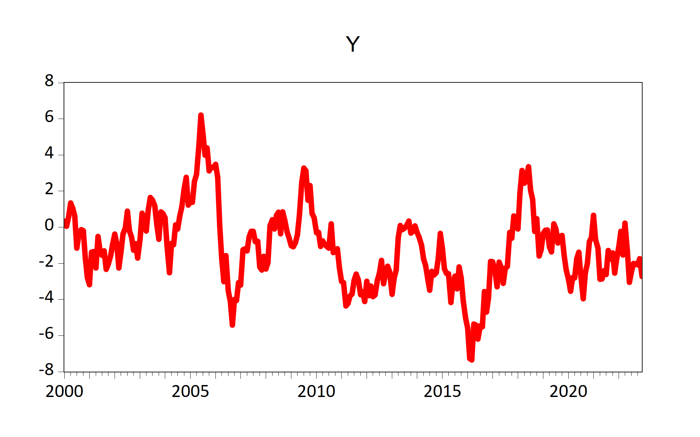

# EviewsR: A Seamless Integration of Eviews and R

# Friday: August 19, 2022


<!-- badges: start -->

[](https://cran.r-project.org/package=EviewsR)
[](https://cranlogs.r-pkg.org/badges/grand-total/EviewsR?color=49C31B)
[](https://cranlogs.r-pkg.org/badges/EviewsR?color=49C31B)

<!-- badges: end -->

# 1 About the Author

The author of this package, **Sagiru Mati**, obtained his PhD in
Economics from the Near East University, North Cyprus. He works at the
Department of Economics, Yusuf Maitama Sule (Northwest) University,
Kano, Nigeria. Please visit his [website](https://smati.com.ng) for more
details.

Please follow his publications on [**ORCID:
0000-0003-1413-3974**](https://orcid.org/0000-0003-1413-3974)

# 2 About EviewsR

EviewsR is an R package that can run EViews program in R. It also adds
`eviews` as a knit-engine to `knitr` package, so that users can embed
EViews codes in R Markdown and Quarto document.

# 3 Why EviewsR?

While the ecosystem of R is great, it cannot run EViews codes, not talk
of handling EViews objects dynamically and reproducibly. Even though,
EViews can communicate with R, users still need to switch to
type-setting application to embed the EViews outputs. Specifically:

-   I wish I could embed EViews codes in R Markdown or Quarto document

-   I wish I could dynamically import the EViews outputs (graphs,
    tables, equation and series) individually or at once into R, R
    Markdown or Quarto document without switching between these
    applications back and forth.

-   I wish I could use an R function in R, R Markdown or Quarto to:

    -   graph EViews series objects.

    -   graph an R dataframe using EViews.

    -   import data from external sources such as `csv`, `xlsx` as a new
        EViews workfile or into an existing workfile.

    -   create an EViews workfile from an R dataframe

    -   save an EViews workfile page as a workfile or another file
        format.

    -   execute EViews codes.

    -   export an R dataframe as a new EViews workfile or to an existing
        EViews workfile.

    -   save an EViews workfile as a workfile or another file format.

    -   import EViews table object as `kable`.

    -   import EViews series objects as a dataframe or `xts` object

    -   import equation data members such as coefficients, standard
        errors, *R*<sup>2</sup> and so on.

    -   import EViews graph objects

    -   import equation data members, graph, series and table objects
        all at once.

    -   simulate a random walk process using EViews.

-   I wish I could do all of the above without opening the EViews!!!

# 4 Installation

EviewsR can be installed using the following commands in R.

    install.packages("EviewsR")
    OR
    devtools::install_github("sagirumati/EviewsR")

# 5 Setup

To run the package successfully, you need to do one of the following

-   Don’t do anything if the name of EViews executable is one of the
    following: `EViews13_x64`, `EViews13_x86`,`EViews12_x64`,
    `EViews12_x86`, `EViews11_x64`, `EViews11_x86`,`EViews10_x64`,
    `EViews10_x86`,`EViews9_x64`, `EViews9_x86`, `EViews10`. The package
    will find the executable automatically.

-   Rename the Eviews executable to `eviews` or one of the names above.

-   Alternatively, you can use `set_eviews_path()` function to set the
    path the EViews executable as follows:

<!-- -->

    set_eviews_path("C:/Program Files (x86)/EViews 10/EViews10.exe")

# 6 Usage

Please load the EviewsR package as follows:

    ```{r}                                                                .
    library(EviewsR)
    ```

# 7 Ways to use EviewsR

The package can work with base R, R Markdown or Quarto document.

## 7.1 EviewsR along with R Markdown or Quarto document

After loading the package, a chunk for Eviews can be created by
supplying `eviews` as the engine name in R Markdown or Quarto document
as shown below :

    ```{eviews} 
    #| label: fig-EviewsR
    #| eval: true
    #| fig.subcap: ["X graph","Y graph"]
    #| fig.cap: "EViews graphs imported automatically by fig-EviewsR chunk"

        'This program is created in R Markdown with the help of EviewsR package
      
      wfcreate(page=EviewsRPage,wf=EviewsR_workfile) m 2000 2022
      for %y EviewsR package page1 page2
      pagecreate(page={%y}) EviewsR m 2000 2022
      next
      pageselect EviewsRPage
      rndseed 123456
      genr y=@cumsum(nrnd)
      genr x=@cumsum(nrnd)
      equation ols.ls y c x
      freeze(OLSTable,mode=overwrite) ols
      freeze(EviewsR_Plot,mode=overwrite) y.line
      wfsave EviewsR_workfile
    ```  


<p class="caption">
Figure 7.1: EViews graphs imported automatically by fig-EviewsR chunk
</p>

The above chunk creates an Eviews program with the chunk’s content, then
automatically open Eviews and run the program, which will create an
Eviews workfile with pages containing monthly sample from 2000 to 2022.
The program will also save an EViews workfile named `EviewsR_workfile`
in the current directory.

The `eviews` chunk automatically returns the outputs of each equation
object as a dataframe, accessible via
`chunkLabel$pageName_equationName`. For example, The *R*<sup>2</sup> of
the `ols` equation object is 0.044951, which can be accessed using
`` `r EviewsR$eviewsrpage_ols$r2` ``. We can obtain the table object by
`chunkLabel$pageName_tableName`. Therefore,
`EviewsR$eviewsrpage_olstable` will give us the `OLSTable` object as
dataframe. Note the underscore (`_`) between the `pageName` and
`equationName`, and between the `pageName` and `tableName`.

    EviewsR$eviewsrpage_ols$r2
    #> [1] 0.044951
    EviewsR$eviewsrpage_ols$aic
    #> [1] 4.310163
    K = EviewsR$eviewsrpage_olstable[c(6, 8, 9), 1:5]
    colnames(K) = NULL
    knitr::kable(K, row.names = F, caption = "Selected cells of  EViews table object")

<table>
<caption>Table 7.1: Selected cells of EViews table object</caption>
<tbody>
<tr class="odd">
<td style="text-align: left;">Variable</td>
<td style="text-align: left;">Coefficient</td>
<td style="text-align: left;">Std. Error</td>
<td style="text-align: left;">t-Statistic</td>
<td style="text-align: left;">Prob.</td>
</tr>
<tr class="even">
<td style="text-align: left;">C</td>
<td style="text-align: left;">-0.301413</td>
<td style="text-align: left;">0.260956</td>
<td style="text-align: left;">-1.155033</td>
<td style="text-align: left;">0.2491</td>
</tr>
<tr class="odd">
<td style="text-align: left;">X</td>
<td style="text-align: left;">-0.051410</td>
<td style="text-align: left;">0.014316</td>
<td style="text-align: left;">-3.591137</td>
<td style="text-align: left;">0.0004</td>
</tr>
</tbody>
</table>

Table 7.1: Selected cells of EViews table object

The EViews series objects are also imported automatically as dataframe
(by default) or `xts` objects (if we use chunk option `class="xts"`).
They are accessed via `chunkLabel$pageName`.

    EviewsR$eviewsrpage %>%
        head()
    #>         date           x          y
    #> 1 2000-01-01 -0.06062345 0.34705763
    #> 2 2000-02-01  0.40287977 0.04959103
    #> 3 2000-03-01  1.13387526 0.56589164
    #> 4 2000-04-01  1.34089330 1.35264827
    #> 5 2000-05-01  0.54596099 1.05434874
    #> 6 2000-06-01  0.96869514 0.61693341

## 7.2 EviewsR along with base R

### 7.2.1 The create\_object() function

The function `create_object()` can be used to create an Eviews object in
the existing EViews workfile.

    create_object(wf = "EviewsR_workfile", action = "equation", action_opt = "",
        object_name = "eviews_equation", view_or_proc = "ls", options_list = "",
        arg_list = "y ar(1)")

    create_object(wf = "EviewsR_workfile", object_name = "x1", object_type = "series",
        expression = "y^2")

### 7.2.2 The eviews\_graph() function

EViews graphs can be included in R Markdown or Quarto document by
`eviews_graph()` function.

To create graph from existing EViews series objects:

    eviews_graph(wf = "EviewsR_workfile", page = "EviewsRPage", series = "x y",
        mode = "overwrite", graph_options = "m")


<p class="caption">
Figure 7.2: Graphs of existing EViews series objects imported by
fig-eviewsGraph chunk
</p>

We can also create graph objects from an R dataframe

    Data = data.frame(x = cumsum(rnorm(100)), y = cumsum(rnorm(100)))
    eviews_graph(series = Data, group = TRUE, start_date = "1990Q4",
        frequency = "Q")


<p class="caption">
Figure 7.3: Graphs of an R dataframe imported by fig-eviewsGraph1 chunk
</p>

### 7.2.3 The eviews\_import() function

Data can be imported from external sources by `eviews_import()`
function.

    eviews_import(source_description = "eviews_import.csv", start_date = "1990",
        frequency = "m", rename_string = "x ab", smpl_string = "1990m10 1992m10")

Alternatively, use the dataframe as the `source_description`.

    eviews_import(source_description = Data, wf = "eviews_import1",
        start_date = "1990", frequency = "m", rename_string = "x ab",
        smpl_string = "1990m10 1992m10")

### 7.2.4 The eviews\_pagesave() function

Similar to Eviews workfile, an Eviews page can be saved in various
formats by `eviews_pagesave()` function.

    eviews_pagesave(wf = "eviewsr_workfile", page = "EviewsRPage",
        source_description = "pagesave.csv", drop_list = "y")

### 7.2.5 The eviews\_wfcreate() function

An Eviews workfile can be created using `eviews_wfcreate()` function in
R.

    eviews_wfcreate(wf = "eviews_wfcreate", page = "EviewsRPage",
        frequency = "m", start_date = "1990", end_date = "2022")

Create a workfile from a dataframe

    eviews_wfcreate(source_description = Data, wf = "eviews_wfcreate1",
        page = "EviewsR_page", frequency = "m", start_date = "1990")

### 7.2.6 The eviews\_wfsave() function

An EViews workfile can be saved various output formats using
`eviews_wfsave()` in function in R.

    eviews_wfsave(wf = "eviewsr_workfile", source_description = "wfsave.csv")

### 7.2.7 The exec\_commands() function

A set of Eviews commands can be executed with the help of
`exec_commands()` function in R.

    exec_commands(c("wfcreate(wf=exec_commands,page=eviewsPage) m 2000 2022"))

    eviewsCommands = "pagecreate(page=eviewspage1) 7 2020 2022
    for %page eviewspage eviewspage1
    pageselect {%page}
    genr y=@cumsum(nrnd)
    genr x=@cumsum(nrnd)
    equation ols.ls y c x
    graph x_graph.line x
    graph y_graph.area y
    freeze(OLSTable,mode=overwrite) ols
    next
    "
    exec_commands(commands = eviewsCommands, wf = "exec_commands")

### 7.2.8 The export\_dataframe() function

Use `export_dataframe()` function to export dataframe object to Eviews.

    export_dataframe(wf = "export_dataframe", source_description = Data,
        start_date = "1990", frequency = "m")

### 7.2.9 The import\_equation() function

Import EViews equation data members into R, R Markdown or Quarto.

    import_equation(wf = "EviewsR_workfile", page = "EviewsRPage",
        equation = "OLS")

To access the imported equation in base R:

### 7.2.10 The import\_graph() function

Import EViews graph objects(s) into R, R Markdown or Quarto.

    import_graph(wf = "eviewsr_workfile")


<p class="caption">
Figure 7.4: EViews graphs imported using import\_graph() function
</p>

To import only graphs that begin with x:

    import_graph(wf = "exec_commands", graph = "x*")


<p class="caption">
Figure 7.5: EViews graphs that begin with X imported using
import\_graph() function
</p>

### 7.2.11 The import\_kable() function

Eviews tables can be imported as `kable` object by `import_kable()`
function. Therefore, we can include the

    import_kable(wf = "EViewsR_workfile", page = "EviewsRPage", table = "OLSTable",
        format = "html", caption = "Selected cells of EViews table imported using import_kable() function",
        range = "r7c1:r10c5", digits = 3)

<table>
<caption>
Table 7.2: Selected cells of EViews table imported using import\_kable()
function
</caption>
<thead>
<tr>
<th style="text-align:left;">
Variable
</th>
<th style="text-align:right;">
Coefficient
</th>
<th style="text-align:right;">
Std. Error
</th>
<th style="text-align:right;">
t-Statistic
</th>
<th style="text-align:right;">
Prob.
</th>
</tr>
</thead>
<tbody>
<tr>
<td style="text-align:left;">
C
</td>
<td style="text-align:right;">
-0.301
</td>
<td style="text-align:right;">
0.261
</td>
<td style="text-align:right;">
-1.155
</td>
<td style="text-align:right;">
0.249
</td>
</tr>
<tr>
<td style="text-align:left;">
X
</td>
<td style="text-align:right;">
-0.051
</td>
<td style="text-align:right;">
0.014
</td>
<td style="text-align:right;">
-3.591
</td>
<td style="text-align:right;">
0.000
</td>
</tr>
</tbody>
</table>

### 7.2.12 The import\_series() function

Use `import_series()` function to import data from EViews to R as a
dataframe. The function creates a new environment `eviews`, whose
objects can be accessed via `eviews$pageName`.

    import_series(wf = "eviewsr_workfile")

To access the series in base R:

    eviews$eviewspage %>%
        head()

To import the series as an `xts` object:

    import_series(wf = "eviewsr_workfile", series = c("x", "y"),
        class = "xts")

### 7.2.13 The import\_table() function

Import EViews table objects(s) into R, R Markdown or Quarto.

To import all table objects across all pages

    import_table(wf = "EviewsR_workfile")

To import specific table objects, for example `OLSTable`

    import_table(wf = "EviewsR_workfile", table = "OLStable")

To import table objects on specific pages

    import_table(wf = "EviewsR_workfile", page = " EviewsRPage")

To access the table in base R (`eviews$pageName_tableName`)

    eviews$eviewspage_olstable

### 7.2.14 The import\_workfile() function

Import EViews equation data members, graph, series and table objects(s)
into R, R Markdown or Quarto. This function is a blend of
`import_equation()`, `import_graph()`, `import_series()` and
`import_table()` functions.

To import all equation, graph, series and table objects across all pages

    import_workfile(wf = "EviewsR_workfile")


<p class="caption">
Figure 7.6: EViews graphs automatically imported by import\_workfile()
function
</p>

To import specific objects

    import_workfile(wf = "exec_commands", equation = "ols", graph = "x*",
        series = "y*", table = "ols*")

To import objects on specific page(s)

    import_workfile(wf = "exec_commands", page = "eviewspage eviewspage1")

To access the objects in base R:

    eviews$eviewspage_ols  # equation
    # eviewspage-x_graph # graph saved in 'figure/' folder
    eviews$eviewspage %>%
        head()  # series
    eviews$eviewspage_olstable  # table

### 7.2.15 The rwalk() function

A set of random walk series can be simulated in R using EViews engine,
thanks to `rwalk()` function.

    rwalk(wf = "eviewsr_workfile", series = "X Y Z", page = "", rndseed = 12345,
        frequency = "M", num_observations = 100, class = "xts")

    xts::plot.xts(rwalk$xyz, type = "l", main = "")
    ggplot2::autoplot(rwalk$xyz, facet = "")


<p class="caption">
Figure 7.7: Plots of imported EViews random walk series objects
</p>

### 7.2.16 Demo

The demo files are included and can be accessed via
`demo(package="EviewsR")`

    demo(create_object())
    demo(eviews_graph())
    demo(eviews_import())
    demo(eviews_pagesave())
    demo(eviews_wfcreate())
    demo(eviews_wfsave())
    demo(exec_commands())
    demo(export_dataframe())
    demo(import_equation())
    demo(import_graph())
    demo(import_kable())
    demo(import_series())
    demo(import_table())
    demo(import_workfile())
    demo(rwalk())
    demo(set_eviews_path())

# 8 Template

Template for R Markdown is created. Go to
`file->New File->R Markdown-> From Template->EviewsR`.

# 9 Similar Packages

You might be interested in the following packages:

-   [DynareR](https://github.com/sagirumati/DynareR): A Seamless
    Integration of Dynare and R.

-   [gretlR](https://github.com/sagirumati/gretlR): A Seamless
    Integration of gretl and R.

<br><br><br><br>

Please download the example files from
[Github](https://github.com/sagirumati/EviewsR/tree/master/inst/examples/).
