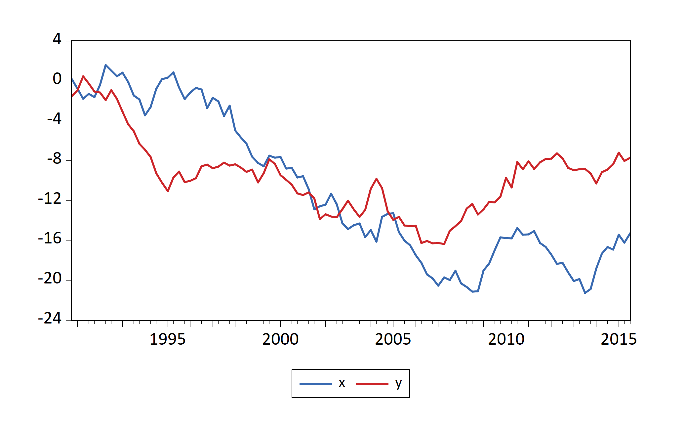
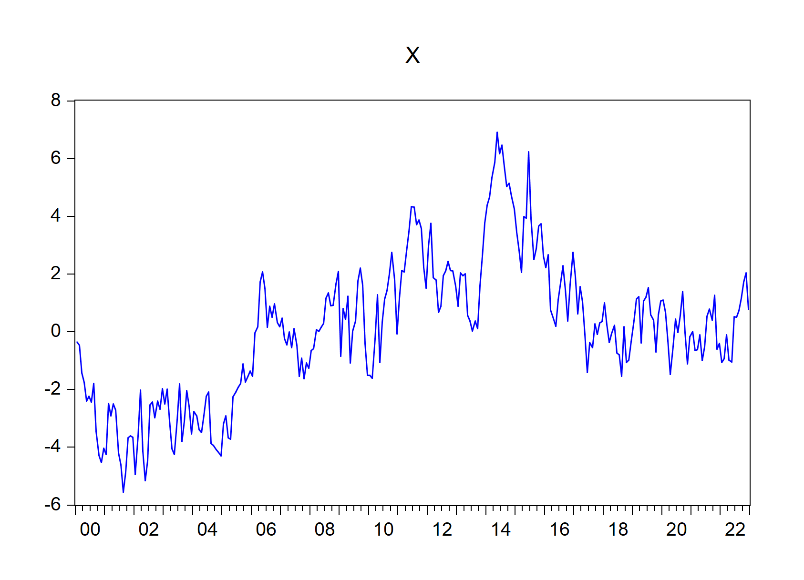
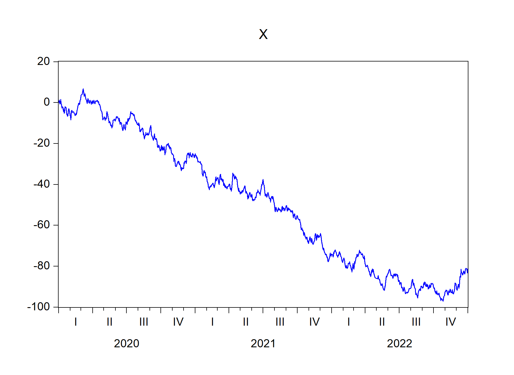

EviewsR: A Seamless Integration of Eviews and R
================
Sagiru Mati
August 8, 2022

# EviewsR 

<!-- badges: start -->

[](https://cran.r-project.org/package=EviewsR)
[](https://cranlogs.r-pkg.org/badges/grand-total/EviewsR?color=49C31B)
[](https://cranlogs.r-pkg.org/badges/EviewsR?color=49C31B)

<!-- badges: end -->

# About the Author

The author of this package, **Sagiru Mati**, obtained his PhD in
Economics from the Near East University, North Cyprus. He works at the
Department of Economics, Yusuf Maitama Sule (Northwest) University,
Kano, Nigeria. Please visit his [website](https://smati.com.ng) for more
details.

Please follow his publications on **ORCID: 0000-0003-1413-3974**

# About EviewsR

EviewsR is an R package that can run EViews program in R. It also adds
`eviews` as a knit-engine to `knitr` package, so that users can embed
EViews codes in R Markdown and Quarto document.

# Installation

EviewsR can be installed using the following commands in R.

``` r
install.packages("EviewsR")
OR
devtools::install_github("sagirumati/EviewsR")
```

# Setup

To run the package successfully, you need to do one of the following

-   Don’t do anything if the name of EViews executable is one of the
    following: `EViews13_x64`, `EViews13_x86`,`EViews12_x64`,
    `EViews12_x86`, `EViews11_x64`, `EViews11_x86`,`EViews10_x64`,
    `EViews10_x86`,`EViews9_x64`, `EViews9_x86`, `EViews10`. The package
    will find the executable automatically.

-   Rename the Eviews executable to `eviews` or one of the names above.

-   Alternatively, you can use `set_eviews_path` function to set the
    path the EViews executable as follows:

``` r
set_eviews_path("C:/Program Files (x86)/EViews 10/EViews10.exe")
```

# Usage

Please load the EviewsR package as follows:

    ```{r}                                                                .
    library(EviewsR)
    ```

# Ways to use EviewsR

The package can work with base R, R Markdown or Quarto document.

## EviewsR along with R Markdown or Quarto document

After loading the package, a chunk for Eviews can be created by
supplying `eviews` as the engine name in R Markdown or Quarto document
as shown below :

    ```{eviews} 
    #| label: fig-EviewsR
    #| eval: true
    #| fig.subcap: ["X graph","Y graph"]
    #| fig.cap: "EViews graphs imported automatically by fig-EviewsR chunk"

        'This program is created in R Markdown with the help of EviewsR package
      
      wfcreate(page=EviewsRPage,wf=EviewsR_workfile) m 2000 2022
      for %y EviewsR package page1 page2
      pagecreate(page={%y}) EviewsR m 2000 2022
      next
      pageselect EviewsRPage
      rndseed 123456
      genr y=@cumsum(nrnd)
      genr x=@cumsum(nrnd)
      equation ols.ls y c x
      freeze(OLSTable,mode=overwrite) ols
      freeze(EviewsR_Plot,mode=overwrite) y.line
      wfsave EviewsR_workfile
    ```  

<figure>

<figcaption aria-hidden="true">Figure 1: X graph</figcaption>
</figure>

<figure>

<figcaption aria-hidden="true">Figure 2: Y graph</figcaption>
</figure>

EViews graphs imported automatically by fig-EviewsR chunk

The above chunk creates an Eviews program with the chunk’s content, then
automatically open Eviews and run the program, which will create an
Eviews workfile with pages containing monthly sample from 2000 to 2022.
The program will also save an EViews workfile named `EviewsR_workfile`
in the current directory.

The `eviews` chunk automatically returns the outputs of each equation
object as a dataframe, accessible via
`chunkLabel$pageName_equationName`. For example, The $R^2$ of the `ols`
equation object is 0.044951, which can be accessed using
`` `r EviewsR$eviewsrpage_ols$r2` ``. We can obtain the table object by
`chunkLabel$pageName_tableName`. Therefore,
`EviewsR$eviewsrpage_olstable` will give us the `OLSTable` object as
dataframe. Note the underscore (`_`) between the `pageName` and
`equationName`, and between the `pageName` and `tableName`.

``` r
EviewsR$eviewsrpage_ols$r2
#> [1] 0.044951
EviewsR$eviewsrpage_ols$aic
#> [1] 4.310163
K = EviewsR$eviewsrpage_olstable[c(6, 8, 9), 1:5]
colnames(K) = NULL
knitr::kable(K, row.names = F, caption = "Selected cells of  EViews table object")
```

|          |             |            |             |        |
|:---------|:------------|:-----------|:------------|:-------|
| Variable | Coefficient | Std. Error | t-Statistic | Prob.  |
| C        | -0.301413   | 0.260956   | -1.155033   | 0.2491 |
| X        | -0.051410   | 0.014316   | -3.591137   | 0.0004 |

Selected cells of EViews table object

The EViews series objects are also imported automatically as dataframe
(by default) or `xts` objects (if we use chunk option `class="xts"`).
They are accessed via `chunkLabel$pageName`.

``` r
EviewsR$eviewsrpage |>
    head()
#>         date           x          y
#> 1 2000-01-01 -0.06062345 0.34705763
#> 2 2000-02-01  0.40287977 0.04959103
#> 3 2000-03-01  1.13387526 0.56589164
#> 4 2000-04-01  1.34089330 1.35264827
#> 5 2000-05-01  0.54596099 1.05434874
#> 6 2000-06-01  0.96869514 0.61693341
```

## EviewsR along with base R

### The create_object() function

The function `create_object()` can be used to create an Eviews object in
the existing EViews workfile.

``` r
create_object(wf = "EviewsR_workfile", action = "equation", action_opt = "",
    object_name = "eviews_equation", view_or_proc = "ls", options_list = "",
    arg_list = "y ar(1)")
```

``` r
create_object(wf = "EviewsR_workfile", object_name = "x1", object_type = "series",
    expression = "y^2")
```

### The eviews_graph() function

EViews graphs can be included in R Markdown or Quarto document by
`eviews_graph()` function.

To create graph from existing EViews series objects:

``` r
eviews_graph(wf = "EviewsR_workfile", page = "EviewsRPage", series = "x y",
    mode = "overwrite", graph_options = "m")
```

<figure>

<figcaption aria-hidden="true">Figure 3: Graphs of existing EViews
series objects imported by fig-eviewsGraph chunk</figcaption>
</figure>

<figure>

<figcaption aria-hidden="true">Figure 4: Graphs of existing EViews
series objects imported by fig-eviewsGraph chunk</figcaption>
</figure>

We can also create objects from an R dataframe

``` r
Data = data.frame(x = cumsum(rnorm(100)), y = cumsum(rnorm(100)))
eviews_graph(series = Data, group = TRUE, start_date = "1990Q4",
    frequency = "Q")
```

<figure>

<figcaption aria-hidden="true">Figure 5: Graphs of an R dataframe
imported by fig-eviewsGraph1 chunk</figcaption>
</figure>

### The eviews_import() function

Data can be imported from external sources by `eviews_import()`
function.

``` r
eviews_import(source_description = "eviews_import.csv", start_date = "1990",
    frequency = "m", rename_string = "x ab", smpl_string = "1990m10 1992m10")
```

Alternatively, use the dataframe as the `source_description`.

``` r
eviews_import(source_description = Data, wf = "eviews_import1",
    start_date = "1990", frequency = "m", rename_string = "x ab",
    smpl_string = "1990m10 1992m10")
```

### The eviews_pagesave() function

Similar to Eviews workfile, an Eviews page can be saved in various
formats by `eviews_pagesave()` function.

``` r
eviews_pagesave(wf = "eviewsr_workfile", page = "EviewsRPage",
    source_description = "pagesave.csv", drop_list = "y")
```

### The eviews_wfcreate() function

An Eviews workfile can be created using `eviews_wfcreate()` function in
R.

``` r
eviews_wfcreate(wf = "eviews_wfcreate", page = "EviewsRPage",
    frequency = "m", start_date = "1990", end_date = "2022")
```

Create a workfile from a dataframe

``` r
eviews_wfcreate(source_description = Data, wf = "eviews_wfcreate1",
    page = "EviewsR_page", frequency = "m", start_date = "1990")
```

### The eviews_wfsave() function

An EViews workfile can be saved various output formats using
`eviews_wfsave()` in function in R.

``` r
eviews_wfsave(wf = "eviewsr_workfile", source_description = "wfsave.csv")
```

### The exec_commands() function

A set of Eviews commands can be executed with the help of
`exec_commands()` function in R.

``` r
exec_commands(c("wfcreate(wf=exec_commands,page=eviewsPage) m 2000 2022"))
```

``` r
eviewsCommands = "pagecreate(page=eviewspage1) 7 2020 2022
for %page eviewspage eviewspage1
pageselect {%page}
genr y=@cumsum(nrnd)
genr x=@cumsum(nrnd)
equation ols.ls y c x
graph x_graph.line x
graph y_graph.area y
freeze(OLSTable,mode=overwrite) ols
next
"
exec_commands(commands = eviewsCommands, wf = "exec_commands")
```

### The export_dataframe() function

Use `export_dataframe()` function to export dataframe object to Eviews.

``` r
export_dataframe(wf = "export_dataframe", source_description = Data,
    start_date = "1990", frequency = "m")
```

### The import_equation() function

Import EViews equation data members into R, R Markdown or Quarto.

``` r
import_equation(wf = "EviewsR_workfile", page = "EviewsRPage",
    equation = "OLS")
```

To access the imported equation in base R:

### The import_graph() function

Import EViews graph objects(s) into R, R Markdown or Quarto.

``` r
import_graph(wf = "eviewsr_workfile")
```

<figure>

<figcaption aria-hidden="true">Figure 6: EViews graphs imported using
import_graph() function</figcaption>
</figure>

<figure>

<figcaption aria-hidden="true">Figure 7: EViews graphs imported using
import_graph() function</figcaption>
</figure>

To import only graphs that begin with x:

``` r
import_graph(wf = "exec_commands", graph = "x*")
```

<figure>

<figcaption aria-hidden="true">Figure 8: EViews graphs that begin with X
imported using import_graph() function</figcaption>
</figure>

<figure>

<figcaption aria-hidden="true">Figure 9: EViews graphs that begin with X
imported using import_graph() function</figcaption>
</figure>

### The import_kable() function

Eviews tables can be imported as `kable` object by `import_kable()`
function. Therefore, we can include the

``` r
import_kable(wf = "EViewsR_workfile", page = "EviewsRPage", table = "OLSTable",
    format = "html", caption = "Selected cells of EViews table imported using import_kable() function",
    range = "r7c1:r10c5", digits = 3)
```

<table>
<caption>Selected cells of EViews table imported using import_kable() function</caption>
 <thead>
  <tr>
   <th style="text-align:left;"> Variable </th>
   <th style="text-align:right;"> Coefficient </th>
   <th style="text-align:right;"> Std. Error </th>
   <th style="text-align:right;"> t-Statistic </th>
   <th style="text-align:right;"> Prob. </th>
  </tr>
 </thead>
<tbody>
  <tr>
   <td style="text-align:left;"> C </td>
   <td style="text-align:right;"> -0.301 </td>
   <td style="text-align:right;"> 0.261 </td>
   <td style="text-align:right;"> -1.155 </td>
   <td style="text-align:right;"> 0.249 </td>
  </tr>
  <tr>
   <td style="text-align:left;"> X </td>
   <td style="text-align:right;"> -0.051 </td>
   <td style="text-align:right;"> 0.014 </td>
   <td style="text-align:right;"> -3.591 </td>
   <td style="text-align:right;"> 0.000 </td>
  </tr>
</tbody>
</table>

### The import_series() function

Use `import_series()` function to import data from EViews to R as a
dataframe. The function creates a new environment `eviews`, whose
objects can be accessed via `eviews$pageName`.

``` r
import_series(wf = "eviewsr_workfile")
```

To access the series in base R:

``` r
eviews$eviewspage |>
    head()
```

To import the series as an `xts` object:

``` r
import_series(wf = "eviewsr_workfile", series = c("x", "y"),
    class = "xts")
```

### The import_table() function

Import EViews table objects(s) into R, R Markdown or Quarto.

To import all table objects across all pages

``` r
import_table(wf = "EviewsR_workfile")
```

To import specific table objects, for example `OLSTable`

``` r
import_table(wf = "EviewsR_workfile", table = "OLStable")
```

To import table objects on specific pages

``` r
import_table(wf = "EviewsR_workfile", page = " EviewsRPage")
```

To access the table in base R (`eviews$pageName_tableName`)

``` r
eviews$eviewspage_olstable
```

### The import_workfile() function

Import EViews equation data members, graph, series and table objects(s)
into R, R Markdown or Quarto.

To import all equation, graph, series and table objects across all pages

``` r
import_workfile(wf = "EviewsR_workfile")
```

<figure>

<figcaption aria-hidden="true">Figure 10: EViews graphs automatically
imported by import_workfile() function</figcaption>
</figure>

<figure>

<figcaption aria-hidden="true">Figure 11: EViews graphs automatically
imported by import_workfile() function</figcaption>
</figure>

To import specific objects

``` r
import_workfile(wf = "exec_commands", equation = "ols", graph = "x*",
    series = "y*", table = "ols*")
```

To import objects on specific page(s)

``` r
import_workfile(wf = "exec_commands", page = "eviewspage eviewspage1")
```

### The rwalk() function

A set of random walk series can be simulated in R using EViews engine,
thanks to `rwalk()` function.

``` r
rwalk(wf = "eviewsr_workfile", series = "X Y Z", page = "", rndseed = 12345,
    frequency = "M", num_observations = 100, class = "xts")
```

``` r
xts::plot.xts(rwalk$xyz, type = "l", main = "")
ggplot2::autoplot(rwalk$xyz, facet = "")
```

<figure>

<figcaption aria-hidden="true">Figure 12: Plots of imported EViews
random walk series objects</figcaption>
</figure>

<figure>

<figcaption aria-hidden="true">Figure 13: Plots of imported EViews
random walk series objects</figcaption>
</figure>

<br><br><br><br>

### Demo

The demo files are included and can be accessed via
`demo(package="EviewsR")`

``` r
demo(create_object())
demo(eviews_graph())
demo(eviews_import())
demo(eviews_pagesave())
demo(eviews_wfcreate())
demo(eviews_wfsave())
demo(exec_commands())
demo(export_dataframe())
demo(import_equation())
demo(import_graph())
demo(import_kable())
demo(import_series())
demo(import_table())
demo(import_workfile())
demo(rwalk())
demo(set_eviews_path())
```

# Template

Template for R Markdown is created. Go to
`file->New File->R Markdown-> From Template->EviewsR`.

<br><br><br><br>

Please download the example files from
[Github](https://github.com/sagirumati/EviewsR/tree/master/inst/examples/).
