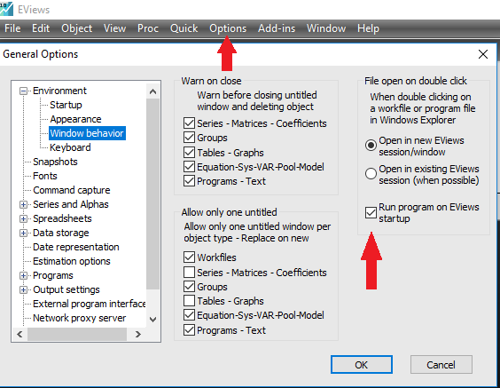

```{r setup, include=FALSE}
knitr::opts_chunk$set(echo = TRUE,comment = NULL)
options(warn = -1)
library(EviewsR)
```

# About EviewsR

EviewsR is an R package that can run Eviews program from R Markdown. 


# Installation

EviewsR can be installed using the following commands in R.

```{r installation,eval=FALSE}
devtools::install_github('sagirumati/EviewsR')

            OR
            
devtools::install_github('smatiacademy/EviewsR')

```


# Setup

To run the package successfully, you need to allow Eviews program to run on Eviews startup. This can be set by clicking on `options, General Options, window behaviour`  and ticking `run program on Eviews startup` as shown below:

```{r image,echo=F,out.height='90%',out.width='90%'}


```

# Usage

Please load the EviewsR package as follows: 

````
```{r EviewsR}                                                                .
library(EviewsR)
```
````


Then create a chunk for Eviews as shown below:

````` 
```{Eviews EviewsR1,eval=T,echo=T,comment=NULL,results='hide'}                .
  'This program is created in R Markdown with the help of EviewsR package
  %path=@runpath
  cd %path
  wfcreate(page=EviewsR) EviewsR m 1999 2019
  for %y Created By Sagiru Mati Northwest University Kano Nigeria
  pagecreate(page={%y}) EviewsR m 1999 2019
  wfsave EviewsR
  next
```  
`````

```{Eviews EviewsR1,eval=T,echo=F,comment=NULL,results='hide'}
  'This program is created in R Markdown with the help of EviewsR package
  %path=@runpath
  cd %path
  wfcreate(page=EviewsR) EviewsR m 1999 2019
  for %y Created By Sagiru Mati Northwest University Kano Nigeria
  pagecreate(page={%y}) EviewsR m 1999 2019
  wfsave EviewsR
  next
```  


The above chunk creates an Eviews program with the chunk's content, then automatically open Eviews and run the program, which will create an Eviews workfile with pages containing monthly sample from 1999 to 2019. The program will also save an Eviews workfile named `EviewsR` in the current directory.

Download [EviewsR.Rmd](https://github.com/smatiacademy/EviewsR/example/EviewsR.Rmd) for a better explanation
