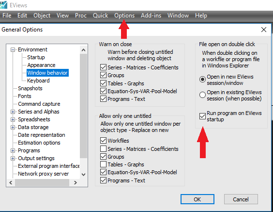

```{r setup, include=FALSE}
knitr::opts_chunk$set(echo = FALSE,comment = NULL)
if(!require(EviewsR)) devtools::install_github('sagirumati/EviewsR')
library(EviewsR)
library(here)
library(knitr)
library(kableExtra)

kable_format <- function(){
  if(opts_knit$get("rmarkdown.pandoc.to")=="docx") format="pandoc"
  if(opts_knit$get("rmarkdown.pandoc.to")=="latex") format="latex"
  if(opts_knit$get("rmarkdown.pandoc.to")=="html") format="html"
  return(format)
}
library(magrittr)
```


# About EviewsR

EviewsR is an R package that can run Eviews program from R Markdown. 


# Installation

EviewsR can be installed using the following commands in R.

```{r installation,eval=FALSE}
install.packages("EviewsR")

          OR
          
devtools::install_github('sagirumati/EviewsR')
```


# Setup

To run the package successfully, you need to allow Eviews program to run on Eviews startup. This can be set by clicking on `options, General Options, window behaviour`  and ticking `run program on Eviews startup` as shown below:

```{r image,echo=F,out.height='90%',out.width='90%'}


```

# Usage

Please load the EviewsR package as follows: 

````
```{r EviewsR}                                                                .
library(EviewsR)
```
````


Then create a chunk for Eviews as shown below:

````` 
```{eviews EviewsR1,eval=T,echo=T,comment=NULL,results='hide'}                .
  'This program is created in R Markdown with the help of EviewsR package
  %path=@runpath
  cd %path
  wfcreate(page=EviewsR) EviewsR m 1999 2020
  for %y Created By Sagiru Mati Northwest University Kano Nigeria
  pagecreate(page={%y}) EviewsR m 1999 2020
  wfsave EviewsR
  next
  pageselect Sagiru
  genr y=rnd
  genr x=rnd
  equation ols.ls y c x
  freeze(EviewsR_OLS,mode=overwrite) ols
  EviewsR_OLS.save(t=csv, r=r7c1:r10c5) EviewsROLS
  EviewsR_OLS.save(t=csv) EviewsRtable
  freeze(EviewsR_Plot,mode=overwrite) y.line
  EviewsR_Plot.save(t=png) EviewsR_Plot_color
  EviewsR_Plot.save(t=png,-c) EviewsR_Plot_nocolor
  exit
```  
`````

```{eviews EviewsR1,eval=F,echo=F,comment=NULL,results='hide'}
  'This program is created in R Markdown with the help of EviewsR package
  %path=@runpath
  cd %path
  wfcreate(page=EviewsR) EviewsR m 1999 2020
  for %y Created By Sagiru Mati Northwest University Kano Nigeria
  pagecreate(page={%y}) EviewsR m 1999 2020
  wfsave EviewsR
  next
  pageselect Sagiru
  genr y=rnd
  genr x=rnd
  equation ols.ls y c x
  freeze(EviewsR_OLS,mode=overwrite) ols
  EviewsR_OLS.save(t=csv, r=r7c1:r10c5) tools\EviewsROLS
  EviewsR_OLS.save(t=csv) tools\EviewsRtable
  freeze(EviewsR_Plot,mode=overwrite) y.line
  EviewsR_Plot.save(t=png) tools\EviewsR_Plot_color
  EviewsR_Plot.save(t=png,-c) tools\EviewsR_Plot_nocolor
  exit
```  


The above chunk creates an Eviews program with the chunk's content, then automatically open Eviews and run the program, which will create an Eviews workfile with pages containing monthly sample from 1999 to 2020. The program will also save an Eviews workfile named `EviewsR` in the current directory.

We can *dynamically and reproducibly* fetch the Eviews graph object we created with the Eviews chunk using the following R chunk: 

For the color graph object:

```{r color,echo=T,fig.cap="Eviews graph object with colour"}
knitr::include_graphics("tools/EviewsR_Plot_color.png")

```


<br><br><br><br>

or the black and white graph object:

```{r nocolor,echo=T,fig.cap="Eviews graph object without colour"}
knitr::include_graphics("tools/EviewsR_Plot_nocolor.png")

```


we can also include the results of the OLS generated by the Eviews chunk using the following R chunk;

For the OLS result only:

```{r OLS,echo=T}
olsResult=read.csv("tools/EviewsROLS.csv")
knitr::kable(olsResult)
```

<br><br><br><br>

or the entire OLS output:

```{r OLStable,echo=T}
olsTable=read.csv("tools/EviewsRtable.csv")
knitr::kable(olsTable,format = "html")
```


<br><br><br><br>


Please visit my [Github](https://github.com/sagirumati/EviewsR/tree/master/example) for a better explanation and example files.


Table \@ref(tab:ttt2) 

```{r}
EviewsR::eviews_rwalk(series = "x y z")
```


```{r command}
eviews_commands("wfcreate m 1990 +90")
```

```{r ttt2}
import_table("eviewsr1",table_name = "SAGIRU",caption = "Some Nice Caption",digits = 2)
```


(ref:chunkFootnote) insert footnote here
```{r chunk,echo=F,eval=F}
chunk=read.csv("TABLES/table.csv",allowEscapes = T,header = T,check.names = FALSE,colClasses = "character")
chunkKable=kable(chunk,format=ifelse(knitr::opts_knit$get("rmarkdown.pandoc.to")=="docx","pandoc","latex"),booktabs=T,caption="caption",escape=F,linesep="")
```


```{r chunk-latex, eval=F}
chunkKable=kable_styling(chunkKable,latex_options = c("basic","hold_positon","scale_down")) %>%
footnote(general="(ref:chunkFootnote)", general_title = "",footnote_as_chunk=T,threeparttable=T,escape=F) %>%
row_spec(0,bold=T)
chunkKable
```

```{r chunk-docx, eval=F}
chunkKable
y="(ref:chunkFootnote)"
kable(y,format=ifelse(knitr::opts_knit$get("rmarkdown.pandoc.to")=="docx","pandoc","latex"),booktabs=T,escape=F,col.names = NULL,linesep="")
```

```{r,eval=F}
unlink("C:/Users/SMATI/Google Drive/GITHUB/Repos/sagirumati/EviewsR/inst/examples/sagiru.csv",recursive = T,force = T)

```

