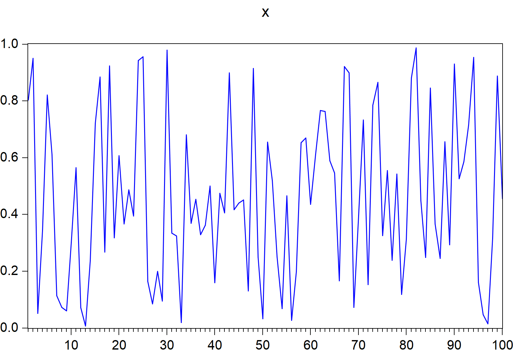
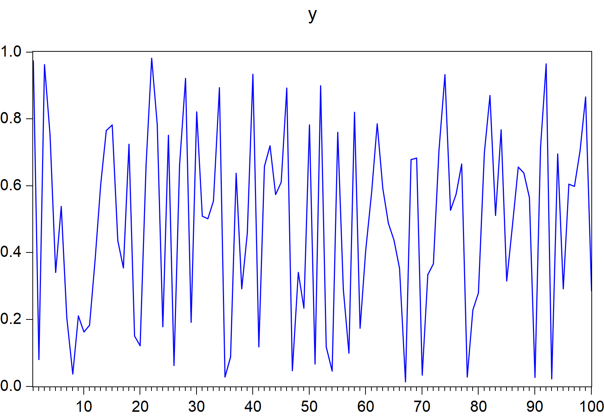

```{r setup, include = FALSE}

library(EviewsR)
library(knitr)
```


# About the Author


The author of this package, **Sagiru Mati**, obtained his PhD in Economics from the Near East University, North Cyprus. He works
at the Department of Economics, Yusuf Maitama Sule (Northwest)
University, Kano, Nigeria. Please visit his [website](https://smati.com.ng) for more details.

Please follow his publications with his **ORCID: 0000-0003-1413-3974**

# About EviewsR

EviewsR is an R package that can run Eviews program from R Markdown. 


# Installation

EviewsR can be installed using the following commands in R.

```{r installation,eval=FALSE}
install.packages("EviewsR") 

            OR
            
devtools::install_github('sagirumati/EviewsR')
```


# Setup

To run the package successfully, you need to the Eviews executable to `eviews` and then add the EViews installation folder to path.

# Usage

Please load the EviewsR package as follows: 

````
```{r}                                                                .
library(EviewsR)
```
````


Then create a chunk for Eviews as shown below:

````` 
```{eviews EviewsR,eval=T,echo=T,comment=NULL,results='hide'}                .
    'This program is created in R Markdown with the help of EviewsR package
  %path=@runpath
  cd %path
  wfcreate(page=EviewsR_page,wf=EviewsR_workfile) m 2000 2022
  for %y EviewsR package page1 page2
  pagecreate(page={%y}) EviewsR m 2000 2022
  next
  pageselect EviewsR_page
  rndseed 123456
  genr y=rnd
  genr x=rnd
  equation ols.ls y c x
  freeze(EviewsROLS,mode=overwrite) ols
  freeze(EviewsR_Plot,mode=overwrite) y.line
  wfsave EviewsR_workfile
  exit
```  
`````


```{eviews EviewsR,eval=F,echo=F,comment=NULL}            
    'This program is created in R Markdown with the help of EviewsR package
  %path=@runpath
  cd %path
  wfcreate(page=EviewsR_page,wf=EviewsR_workfile) m 2000 2022
  for %y EviewsR package page1 page2
  pagecreate(page={%y}) EviewsR m 2000 2022
  next
  pageselect EviewsR_page
  rndseed 123456
  genr y=rnd
  genr x=rnd
  equation ols.ls y c x
  freeze(EviewsROLS,mode=overwrite) ols
  freeze(EviewsR_Plot,mode=overwrite) y.line
  wfsave EviewsR_workfile
  exit
```  


The above chunk creates an Eviews program with the chunk's content, then automatically open Eviews and run the program, which will create an Eviews workfile with pages containing monthly sample from 2000 to 2022. The program will also save an Eviews workfile named `EviewsR` in the current directory.


```{r eviewsCommands,eval=T}
eviews_commands(c('%path=@runpath','cd %path',
  'wfcreate(page=EviewsR_page,wf=EviewsR_workfile) m 2000 2022',
  'for %y EviewsR package page1 page2',
  'pagecreate(page={%y}) EviewsR m 2000 2022',
  'next',
'  pageselect EviewsR_page',
  'rndseed 123456',
'  genr y=rnd',
  'genr x=rnd',
  'equation ols.ls y c x',
  'freeze(EviewsROLS,mode=overwrite) ols',
  'freeze(EviewsR_Plot,mode=overwrite) y.line',
  'wfsave EviewsR_workfile',
  'exit'))

```

we can also include the results of the OLS generated by the Eviews chunk using the following R chunk;

For the OLS result only:


```{r importTable,echo=T,eval=T}
import_table(wf="EViewsR_workfile",page="EviewsR_page",table_name = "EViewsrOLS",table_range = "r7c1:r10c5")
```

<br><br><br><br>

or the entire OLS output:

```{r OLStable,echo=T,eval=F}
olsTable=read.csv("EviewsRtable.csv")
knitr::kable(olsTable,format = "html")
```


```{r eviewsGraph, eval=T,fig.cap=c("some figure"),out.height="\\textwidth",out.width="\\textwidth"}

par(mfrow=c(2,2))

y=runif(100)
x=runif(100)
plot(x)
uu=data.frame(x,y)
 eviews_graph(wf="EviewsR_workfile",page = "EviewsR_page",series=uu,mode = "overwrite",options = "m",merge_graphs=F,start_date="1",frequency="u",save=T,save_path = '')
#eviews_graphics=list.files(pattern=paste0("x",'_graph_eviewsr'),ignore.case = T)
#knitr::include_graphics(paste(eviews_graphics))

# 
# 
cat(getwd())
```


```{r graphfunction,out.height="\\textwidth",out.width="\\textwidth"}

    # graphf()
k='y_graph_eviewsr.png'
# include_graphics(k)
```
<br><br><br><br>


Please see the example files for a better explanation.
